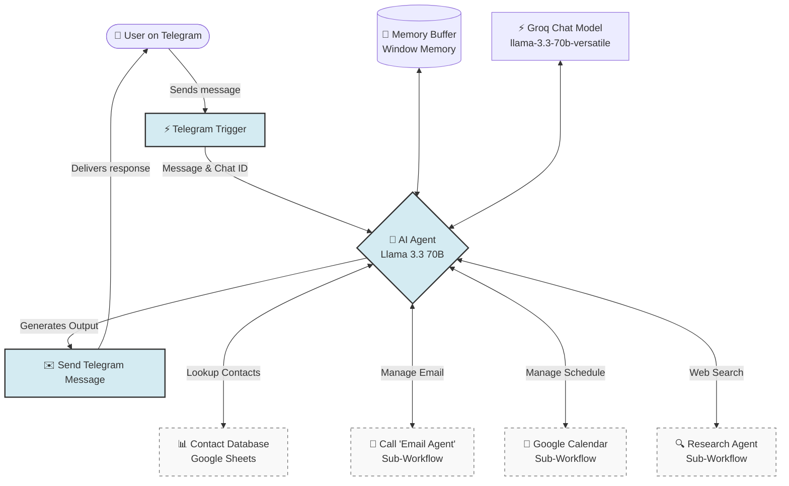

# 🤖 n8n AI Personal Assistant

An advanced, autonomous AI-powered Personal Assistant built on [n8n](https://n8n.io/) and powered by the high-performance **Groq Llama 3.3 70B** model. This workflow enables you to interact with your personal digital workspace (contacts, email, calendar, and web research) directly through a private **Telegram** chat.

---

## 🗺️ System Architecture

The workflow behaves as an **autonomous agentic cycle** in n8n. The main AI Agent evaluates incoming user prompts from Telegram, retains conversational context using memory, and dynamically calls specialized tools or sub-workflows depending on your request.



---

## ✨ Key Features

- **Conversational Memory**: Retains the context of your conversation across chat sessions using a custom key bound to your Telegram Chat ID.
- **Dynamic Contact Lookup**: Directly queries a Google Sheet to fetch email addresses, phone numbers, or notes for names mentioned in chat prompts (e.g., *"Find Rakesh's email"*).
- **Gmail Automation (Email Agent)**: Reads, searches, summarizes, or sends emails autonomously by delegating to a dedicated sub-workflow.
- **Calendar Management**: Adds, searches, or updates events in Google Calendar via a specialized calendar sub-agent.
- **Deep Web Research**: Searches the internet and compiles structured reports using a dedicated research sub-workflow.

---

## 📋 Prerequisites

To run this workflow, you need:
1. **n8n Instance**: A self-hosted n8n installation or an n8n Cloud account.
2. **Telegram Bot**: A Telegram bot token obtained from the [@BotFather](https://t.me/BotFather).
3. **Groq API Key**: An API key from [Groq Console](https://console.groq.com/) (using the `llama-3.3-70b-versatile` model).
4. **Google Workspace App Credentials**: An OAuth2 configuration in Google Cloud Console to grant access to:
   - Google Sheets (for the contacts database)
   - Gmail (for the Email Agent sub-workflow)
   - Google Calendar (for the Calendar Agent sub-workflow)

---

## 🚀 Setup & Installation

### 1. Clone the Repository
```bash
git clone https://github.com/your-username/n8n-personal-assistant.git
cd n8n-personal-assistant
```

### 2. Configure Credentials
1. Copy the `.env.example` file to `.env`:
   ```bash
   cp .env.example .env
   ```
2. Open `.env` and fill in your keys (e.g., `GROQ_API_KEY`, `TELEGRAM_BOT_TOKEN`).

### 3. Set Up Your Contact Database
Create a Google Sheet named **Contacts** with at least the following headers in the first sheet (`sheet`):
- `Name` (e.g., "Rakesh")
- `Email` (e.g., "rakesh@example.com")
- `Phone` (e.g., "+123456789")

Copy the Spreadsheet ID from the URL and update it in the **Contact_Database** Google Sheets Tool node settings.

### 4. Import Workflows to n8n
1. Open your n8n dashboard.
2. Create a new workflow.
3. Click the menu icon (top right) -> **Import from File**.
4. Select `workflows/Personal-Assistant.json`.
5. Connect your credentials for:
   - **Telegram API** (Telegram Trigger & Send Message nodes)
   - **Groq API** (Groq Chat Model node)
   - **Google Sheets API** (Contact_Database node)

> [!NOTE]
> This main assistant references three sub-workflows as tools. You will need to export/create and import these matching workflows in n8n and link them by their respective workflow IDs:
> - **Email Agent**: Linked via workflow ID `ibDUSWcyoiXpugSw`
> - **Google Calendar Agent**: Linked via workflow ID `FYA3bJtUhzF9UWI5`
> - **Research Agent**: Linked via workflow ID `l7enHsjnru5PCvhO`

---

## 🛠️ Node Breakdown & Workflow Logic

### 1. Memory Configuration
Uses a **Simple Memory (Window Buffer)** node. To ensure multi-user isolation, the `Session Key` is dynamically bound to the user's Telegram Chat ID:
```javascript
={{ $('Telegram Trigger').item.json.message.chat.id }}
```

### 2. Contact Database Lookup
Using a **Google Sheets Tool**, the agent extracts names from your conversation using parameters defined dynamically by the AI:
- Parameter: `contact_name`
- Prompt mapping: `"The name of the contact mentioned by the user. Example: if the user says 'send an email to Rakesh', return 'Rakesh'."`
- It filters the Sheet rows where `Name = contact_name`.

### 3. Sub-Workflow Agent Tools
The workflow triggers sub-agents as tool definitions:
- **Email Agent**: Passes the `user_request` variable downstream.
- **Google Calendar**: Passes the `user_prompt` variable downstream.
- **Research Agent**: Invoked asynchronously for search-heavy inquiries.

---

## 🤝 Contributing

Contributions are welcome! If you build out better sub-agents or add additional tools (like Slack, Notion, or Todoist integration), feel free to open a Pull Request.

## 📄 License

This project is licensed under the MIT License - see the LICENSE file for details.
